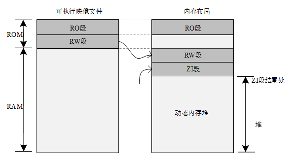
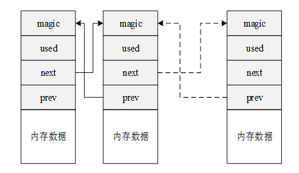

### 简介
* 内存分类：内部存储空间和外部存储空间。
* 内部存储空间：访问速度比较快，能够按照变量地址随机的访问，即RAM(随机存储器)，可以把它理解为电脑的内存；
* 外部存储空间：所保存的内容比较固定，即使掉点后数据也不会丢失，即ROM（只读存储器），可以把它理解为电脑的硬盘。
* 关于以上两种内存管理方式，分别是动态内存堆管理和静态内存池管理。

### 内存管理的功能特点
由于实时系统中对时间的要求非常严格，内存管理往往要比通用操作系统要求苛刻得多：

1. 分配内存的时间必须是确定的。一般内存管理算法是根据需要存储的数据的长度在内存中去寻找一个与这段数据相适应的空闲内存块，然后将数据存储在里面。
2. 随着内存不断被分配和释放，整个内存区域会产生越来越多的碎片，系统还有足够的空闲内存，但因为它们地址并非连续，不能组成一块连续的完整内存块，会使得程序不能申请到大的内存。
3. 针对不同的系统，选择适合他们的高效率内存分配算法。

RT-Thread根据上层应用及系统资源的不同，有针对性地提供了不同的内存分配管理算法。总体上可分为两类：内存堆管理与内存池管理，而内存堆管理又根据具体内存设备划分为三种情况：
* 针对小内存块的分配管理(小内存管理算法)；
* 针对大内存块的分配管理(slab管理算法)；
* 针对多内存堆的分配情况(memheap管理算法)。

### 内存堆管理
内存堆管理用于管理一段连续的内存空间，如下图琐事，ＲＴ－Ｔｈｒｅａｄ将“ＺＩ段结尾处”到内存尾部的空间用做内存堆。

内存堆可以在当前资源满足的情况下，根据用户的需求分配任意大小的内存块。而当用户不需要再使用这些内存块时又可以释放回堆中供其他应用分配使用。
* 小内存管理算法：针对系统资源比较少，一般用于小于2MB内存空间的系统；
* slab内存管理算法：主要在系统资源比较丰富时，提供一种近似多内存池管理算法；
* memheap管理算法：适用于系统存在多个内存堆的情况，可以将多个内存“粘帖”在一起，形成一个大的内存堆。

### 小内存管理算法
小内存管理算法是一个简单的内存分配算法，初始时，它是一块大的内存，当需要分配内存块时，将从这个大的内存块上分割出相匹配的内存块，然后把分割出来的空闲块还给堆管理系统。每个内存块都包含一个管理用的数据头，通过这个头把使用块与空闲块用双向链表的方式链接起来，如下图所示：

* magic:变数（或称为幻数），它会被初始化成0x1ea0(即英文单词heap)，用于标记这个内存块是一个内存管理用的内存数据块，实质也是一个内存保护字；
* used：指示出当前内存块是否已经分配。

