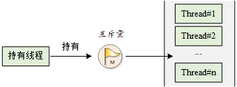
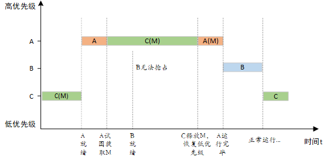
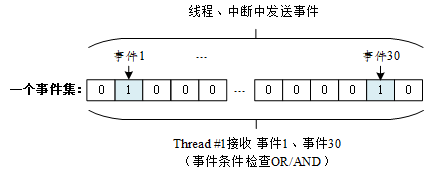
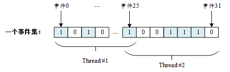

### 简介
在多线程实时操作系统中，一项工作的完成往往可以通过多个线程协调的方式共同来完成，那么多个线程之间如何“默契”协作才能使这项工作无差错执行，这就需要用到线程间同步。

**同步**：是指按预定的先后次序进行运行。

**线程同步**：是指多个线程通过特定的机制(互斥量，事件对象，临界区)来控制线程之间的执行顺序，也可以说是在线程之间通过同步建立起执行顺序的关系，如果没有同步，那线程之间将是无序的。

**临界区**：多个线程操作/访问同一块区域(代码)，例如多个线程同时访问共享内存块，该内存块就是临界区。

**线程互斥**：对于临界区资源访问的排他性，当多个线程都要使用临界区资源时，任何时刻最多只允许一个线程去使用，其它要使用该资源的线程必须等待，直到占用资源者释放该资源。
#### 核心思想
**在访问临界区的时候只允许一个(或一类)线程运行。
在RT-Thread中，进入/退出临界区的方式有很多种：
* 调用 rt_hw_interrupt_disable() 进入临界区，调用 rt_hw_interrupt_enable() 退出临界区；
* 调用 rt_enter_critical() 进入临界区，调用 rt_exit_critical() 退出临界区。

### 信号量
在线程要工作之前，必须要获得信号量，才能访问和释放公共资源。
信号量是一种轻型的用于解决线程间同步问题的内核对象，线程可以获取或释放它，从而达到同步或互斥的目的。
#### 工作机制
信号量工作示意图如下图所示，每个信号量对象都有一个信号量值和一个线程等待队列，信号量的值对应了信号量对象的实例数目、资源数目，假如信号量值为 5，则表示共有 5 个信号量实例（资源）可以被使用，当信号量实例数目为零时，再申请该信号量的线程就会被挂起在该信号量的等待队列上，等待可用的信号量实例（资源）。


#### 信号量控制块
信号控制块是操作系统用于管理信号量的一个数据结构，由结构体struct_semaphore表示。另外一种C表达方式rt_sem_t，表示的是信号量的句柄，在C语言中的实现是指向信号量控制块的指针。详细定义如下：
```c
struct rt_semaphore
{
   struct rt_ipc_object parent;  /* 继承自 ipc_object 类 */
   rt_uint16_t value;              /* 信号量的值 */
};
/* rt_sem_t 是指向 semaphore 结构体的指针类型 */
typedef struct rt_semaphore* rt_sem_t;
```
#### 信号量的管理方式
信号量控制块中含有信号量相关的重要参数，在信号量各种状态间起到纽带的作用。信号量相关接口如下图所示，对一个信号量的操作包含：创建/初始化信号量、获取信号量、释放信号量、删除/脱离信号量。

### 信号量的使用场合
* 信号量是一种非常灵活的同步方式，可以运用在多种场合中；
* 形成锁、同步、资源计数等关系；
* 也能方便的用于线程与线程、中断与线程间的同步中。

#### 线程同步
* 使用信号量进行两个线程之间的同步，信号量的值初始化成0，表示具备0个信号量资源实例，而尝试获得该信号量的线程，将直接在这个信号量上进行等待；
* 当持有信号量的线程完成它处理的工作时，释放这个信号量，可以把等待在这个信号量上的线程唤醒，让它执行下一部分工作。这类场合也可以看成把信号量用于工作完成标志：持有信号量的线程完成它自己的工作，然后通知等待该信号量的线程继续下一部分工作。

#### 锁
**锁**：单一的锁常应用于多个线程间对同一共享资源(即临界区)的访问。
* 信号量在作为锁来使用时，通常应将信号量资源实例初始化成1，代表系统默认有一个资源可用，因为信号量的值始终在1和0之间变动，这类锁也叫做二值信号量；
* 如下图所示，当线程需要访问共享资源时，它需要先获得这个资源锁；

* 当此线程成功获得资源锁时，其他打算访问共享资源的线程会由于获取不到资源而挂起，这个因为其他线程走势图获取这个锁时，这个锁已经被锁上(信号量值为0)；
* 当获得信号量的线程处理完毕，退出临界区时，它会释放信号量并把锁解开，而挂起在锁上的第一个等待线程将被唤醒从而获得临界区的访问权。

#### 中断与线程的同步
* 一个中断触发，中断服务例程需要通知线程进行相应的数据处理，这时候可以设置信号量的初始值是0，线程在试图持有这个信号量时，由于信号量的初始值是0，线程直接在这个信号量上挂起直到信号量被释放；
* 当中断触发时，先进行与硬件相关的动作，例如从硬件的I/O口中读取相应的数据，并确认中断以清除中断源，而后释放一个信号量来唤醒相应的线程以做后续的数据处理。
* 下图所示为FinSH线程的处理方式：


当FinSH线程试图取得信号量时，因为信号量值是0，所以它会被挂起；当consol设备有数据输入时，产生中断，从而进入中断服务例程；在中断服务例程中，它会读取console设备的数据，并把读得的数据放入UART buffer中进行缓冲，而后释放信号量，释放信号量的唤醒shell线程；在中断服务例程运行完毕后，如果系统中没有比shell线程优先级更高的就绪线程存在时，shell线程将持有信号量并运行，从UART buffer缓冲区中获取输入的数据。
* 中断与线程间的互斥不能采用信号量(锁)的方式，而应采用开关中断的方式。

#### 资源计数
* 信号量也可以认为是一个递增或递减的计数器，需要注意的是信号量的值非负。
* 资源计数适合于线程间工作处理速度不匹配的场合，这个时候信号量可以做为前一线程工作完成个数的计数，而当调度到后一线程时，它也可以以一种连续的方式一次处理多个事件。

### 互斥量
互斥量又叫相互排斥的信号量，是一种特殊的二值信号量。互斥量类似于只有一个车位的停车场：当有一辆车进入的时候，将停车场大门锁住，其他车辆在外面等候。当里面的车出来时，将停车场大门打开，下一辆车才可以进入。
#### 互斥量工作机制
* 拥有互斥量的线程拥有互斥量的所有权，互斥量支持递归访问且能防止线程优先级翻转，并且互斥量只能由持有线程释放
* 互斥量的状态只有两种：开锁或闭锁(两种状态值)。线程持有它时，互斥量处于闭锁状态，由这个线程获得它的所有权；该线程释放它时，将对互斥量进行开锁，失去所有权；当一个线程持有互斥量时，其他线程将不能够对它进行开锁或持有它，持有该互斥量的线程也能够再次获得这个锁而不被挂起，如下图时所示。



优先级翻转：即当一个高优先级线程试图通过信号量机制访问共享资源时，如果该信号量已被一低优先级线程持有，而这个低优先级线程在运行过程中可能又被其它一些中等优先级的线程抢占，因此造成高优先级线程被许多具有较低优先级的线程阻塞，实时性难以得到保证。
* 互斥量可以解决优先级翻转问题，通过优先级继承算法来实现
* 优先级继承：提高某个占有某种资源的低优先级线程的优先级，使之与所有等待该资源的线程中优先级最高的那个线程的优先级相等，然后执行，而当这个低优先级线程释放该资源时，优先级重新回到初始设定。
* 例如，通过在线程A尝试获取共享资源而被挂起的期间内，将线程C的优先级提升到A的优先级别，从而解决优先级翻转引起的问题，这样能够防止C被B抢占，如下图所示：



#### 互斥量控制块
互斥量控制块是操作系统用于管理互斥量的一个数据结构，由struct rt_mutex 表示。
```c
struct rt_mutex
    {
        struct rt_ipc_object parent;                /* 继承自 ipc_object 类 */

        rt_uint16_t          value;                   /* 互斥量的值 */
        rt_uint8_t           original_priority;     /* 持有线程的原始优先级 */
        rt_uint8_t           hold;                     /* 持有线程的持有次数   */
        struct rt_thread    *owner;                 /* 当前拥有互斥量的线程 */
    };
    /* rt_mutext_t 为指向互斥量结构体的指针类型  */
    typedef struct rt_mutex* rt_mutex_t;
```
#### 互斥量的管理方式
互斥量相关接口如下图所示，对一个互斥量的操作包含：创建 / 初始化互斥量、获取互斥量、释放互斥量、删除 / 脱离互斥量。

#### 互斥量的使用场合
互斥量的使用比较单一，因为它是信号量的一种，并且它是以锁的形式存在。
* 在初始化的时候，互斥量永远都处于开锁的状态，而被线程持有的时候则立刻转为闭锁的状态。
适合的场合：
* 线程多次持有互斥量的情况下。这样可以避免同一线程多次递归持有而造成死锁的问题。
* 可能会由于多线程同步而造成优先级翻转的情况。

### 事件集
事件集也是线程间同步的机制之一，一个事件集可以包含多个事件，利用事件集可以完成一对多，多对多的线程间同步。
实例：在公交站等公交时可能有以下几种情况：

①P1 坐公交去某地，只有一种公交可以到达目的地，等到此公交即可出发。

②P1 坐公交去某地，有 3 种公交都可以到达目的地，等到其中任意一辆即可出发。

③P1 约另一人 P2 一起去某地，则 P1 必须要等到 “同伴 P2 到达公交站” 与“公交到达公交站”两个条件都满足后，才能出发。

这里，可以将 P1 去某地视为线程，将 “公交到达公交站”、“同伴 P2 到达公交站” 视为事件的发生，情况①是特定事件唤醒线程；情况②是任意单个事件唤醒线程；情况③是多个事件同时发生才唤醒线程。
#### 事件集工作机制
* 事件集主要用于线程间的同步，与信号量不同，它的特点是可以实现一对多，多对多的同步。
* 这种多个事件的集合可以用一个32位无符号整型变量来表示，变量的每一位代表一个事件，线程通过“逻辑与”或“逻辑或”将一个或多个事件关联起来，形成事件组合。
* 事件的“逻辑或”也称为独立型同步，指的是线程与任何事件之一发生同步；事件“逻辑与”也称为关联型同步，指的是线程与若干事件都发生同步。

##### 特点
* 事件只与线程相关，事件间相互独立：每个线程可拥有32个事件标志，采用一个32bit无符号整型数进行记录，每一个bit代表一个事件；
* 事件仅用于同步，不提供数据传输功能；
* 事件无排队性，即多次向线程发送同一事件(如果线程还未来得及读走)，其效果等同于只发送一次。

##### 工作机制
每个线程都拥有一个事件信息标记，它有三个属性，分别是RT_EVENT_FLAG_AND(逻辑与)，RT_EVENT_FLAG_OR(逻辑或)以及RT_EVENT_CLEAR(清除标记)。
当线程等待事件同步时，可以通过32个事件标志和这个事件信息标记来判断当前接收的事件是否满足同步条件。


如上图所示，线程#1的事件标志中第1位和第30位被置位，如果事件信息标记位设为逻辑与，则表示线程#1只有在事件1和事件30都发生以后才会被触发唤醒，如果事件信息标记位设为逻辑或，则事件1或事件30中的任意一个发生都会触发唤醒线程#1。如果信息标记同时设置了清除标记位，则当线程#1唤醒后将主动把事件1和事件30清为零，否则事件标志将依然存在（即置1）。
#### 事件集控制块
在 RT-Thread 中，事件集控制块是操作系统用于管理事件的一个数据结构，由结构体 struct rt_event 表示。另外一种 C 表达方式 rt_event_t，表示的是事件集的句柄，在 C 语言中的实现是事件集控制块的指针。

```c
struct rt_event
{
    struct rt_ipc_object parent;    /* 继承自 ipc_object 类 */

    /* 事件集合，每一 bit 表示 1 个事件，bit 位的值可以标记某事件是否发生 */
    rt_uint32_t set;
};
/* rt_event_t 是指向事件结构体的指针类型  */
typedef struct rt_event* rt_event_t;
```
#### 事件集的管理方式
事件集控制块中含有与事件集相关的重要参数，在事件集功能的实现中起重要的作用。事件集的相关接口如下图所示，对一个事件集的操作包含：创建 / 初始化事件集、发送事件、接收事件、删除 / 脱离事件集。


#### 事件集的使用场合
* 事件集可使用于多种场合，它能够在一定程度上替代信号量，用于线程间同步。
* 一个线程或中断服务例程发送一个事件给事件集对象，而后等待的线程被唤醒并对相应的事件进行处理。
* 与信号量不同的是，事件的发送操作在事件未清除前，是不可累计的，而信号量的释放动作是累计的。
* 事件的接收线程可等待多种事件，即多个事件对应一个线程或多个线程。
* 可以按照线程等待的参数，可选择“逻辑或”触发还是“逻辑与”触发。
* 多事件接收如下图所示：


* 一个事件集中包含32个事件，特定线程只等待、接收它关注的事件。可以是一个线程等待多个事件的到来，也可以是多个线程等待一个事件的到来。