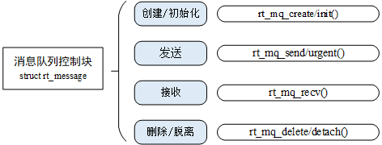

### 线程间通信
RT-Thread中提供了更多的工具帮助在不同的线程中间传递信息，一般是将邮箱、消息队列、信号用于线程间的通信。
### 邮箱
邮箱服务是实时操作系统中一种典型的线程间通信方法。
例如：有两个线程，线程1检测按键状态并发送，线程2读取按键状态并根据按键的状态相应的改变LED的亮灭。这个例子就可以使用邮箱的方式进行通信，线程1将按键的状态作为邮件发送到邮箱，线程2在邮箱中读取邮件中读取邮件获得按键状态并对LED执行亮灭操作。
此外，上例的线程1可以扩展为多个线程。
#### 邮箱的工作机制
* 邮箱用于线程间通信，特点是开销比较低，效率较高。
* 邮箱中的每一封邮件只能容纳固定的4字节内容(针对 32 位处理系统，指针的大小即为 4 个字节，所以一封邮件恰好能够容纳一个指针)。
* 典型的邮箱也称作交换消息，如下图琐事，线程或中断服务例程把一封 4 字节长度的邮件发送到邮箱中，而一个或多个线程可以从邮箱中接收这些邮件并进行处理。


* 非阻塞方式的邮件发送过程能够安全的应用于中断服务中，是线程、中断服务、定时器向线程发送消息的有效手段、
* 邮件收取过程是否堵塞取决于邮箱是否有邮件以及收取邮件时设置的超时时间。
* 当邮件收取阻塞时，只能由线程进行邮件的收取。
* 当一个线程向邮箱发送邮件时，如果没满，则把邮件复制到邮箱中，如果已满，则发送线程可以设置超时时间，选择等待挂起或直接返回。
* 当一个线程从邮箱中接收邮件时，如果邮箱是空的，接收线程可选择等待挂起直到收到新的邮件而唤醒，或可以设置超时时间；如果邮箱存在邮件，那么接收线程将复制邮箱中的4个字节邮件到接收缓存中。

#### 邮箱控制块
在 RT-Thread 中，邮箱控制块是操作系统用于管理邮箱的一个数据结构，由结构体 struct rt_mailbox 表示。另外一种 C 表达方式 rt_mailbox_t，表示的是邮箱的句柄。
```c
struct rt_mailbox
{
    struct rt_ipc_object parent;

    rt_uint32_t* msg_pool;                /* 邮箱缓冲区的开始地址 */
    rt_uint16_t size;                     /* 邮箱缓冲区的大小     */

    rt_uint16_t entry;                    /* 邮箱中邮件的数目     */
    rt_uint16_t in_offset, out_offset;    /* 邮箱缓冲的进出指针   */
    rt_list_t suspend_sender_thread;      /* 发送线程的挂起等待队列 */
};
typedef struct rt_mailbox* rt_mailbox_t;
```
#### 邮箱的管理方式
邮箱的相关接口如下图所示，对一个邮箱的操作包含：创建 / 初始化邮箱、发送邮件、接收邮件、删除 / 脱离邮箱。

##### 创建和删除邮箱
创建：
```c
rt_mailbox_t rt_mb_create (const char* name, rt_size_t size, rt_uint8_t flag);
```
删除：
```c
rt_err_t rt_mb_delete (rt_mailbox_t mb);
```

##### 初始化和脱离
初始化：
```c
rt_err_t rt_mb_init(rt_mailbox_t mb,
                    const char* name,
                    void* msgpool,
                    rt_size_t size,
                    rt_uint8_t flag)
```
脱离：
```c
rt_err_t rt_mb_detach(rt_mailbox_t mb);
```
##### 发送邮件
```c
rt_err_t rt_mb_send (rt_mailbox_t mb, rt_uint32_t value);
```
##### 等待方式发送邮件
```c
rt_err_t rt_mb_send_wait (rt_mailbox_t mb,
                      rt_uint32_t value,
                      rt_int32_t timeout);
```
##### 接收邮件
```c
rt_err_t rt_mb_recv (rt_mailbox_t mb, rt_uint32_t* value, rt_int32_t timeout);
```
#### 邮箱的使用场合
* RT-Thread能够一次传递一个4字节大小的邮件，并且具备一定的存储功能，能够缓存一定数量的邮件数；
* 邮箱中一封邮件的最大长度是4字节，所以邮箱能够用于不超过4字节的消息传递；
* 由于中32系统上4字节的内容恰好可以放置一个指针，因此当需要中线程间传递比较大的消息时，可以把指向一个缓冲区的指针作为邮件发送到邮箱中，即邮箱能够传递指针；

### 消息队列
* 消息队列是另一种常用的线程间通讯方式，是邮箱的扩展。
* 可以应用在多种场合：线程间的消息交换、使用串口接收不定长数据等。

#### 消息队列的工作机制
* 消息队列能够接收来自线程或中断服务例程中不固定长度的消息，并把消息缓存在自己的内存空间中。
* 其他线程也能够从消息队列中读取相应的消息，而当消息队列是空的时候，可以挂起读取线程。
* 当有新的消息到达时，挂起的线程将被唤醒以接收并处理消息。消息队列是一种异步的通信方式。

上图所示，线程或中断服务例程可以将一条或多条消息队列中。同样，一个或多个线程也可以从消息队列中获得消息。当有多个消息发送到消息队列时，通常将先进入消息队列的消息先传给线程，也就是说，线程先得到的是最先进入消息队列的消息，即先进先出原则 (FIFO)。

#### 消息队列控制块
在 RT-Thread 中，消息队列控制块是操作系统用于管理消息队列的一个数据结构，由结构体 struct rt_messagequeue 表示。另外一种 C 表达方式 rt_mq_t。
```c
struct rt_messagequeue
{
    struct rt_ipc_object parent;

    void* msg_pool;                     /* 指向存放消息的缓冲区的指针 */

    rt_uint16_t msg_size;               /* 每个消息的长度 */
    rt_uint16_t max_msgs;               /* 最大能够容纳的消息数 */

    rt_uint16_t entry;                  /* 队列中已有的消息数 */

    void* msg_queue_head;               /* 消息链表头 */
    void* msg_queue_tail;               /* 消息链表尾 */
    void* msg_queue_free;               /* 空闲消息链表 */

    rt_list_t suspend_sender_thread;    /* 发送线程的挂起等待队列 */
};
typedef struct rt_messagequeue* rt_mq_t;
```
#### 消息队列的管理方式
消息队列控制块是一个结构体，其中含有消息队列相关的重要参数，在消息队列的功能实现中起重要的作用。消息队列的相关接口如下图所示，对一个消息队列的操作包含：创建消息队列-发送消息-接收消息-删除消息队列。

##### 创建和删除消息队列
创建消息队列时先从对象管理器中分配一个消息队列对象，然后给消息队列对象分配一块内存空间，组织成空闲消息链表，这块内存的大小 =[消息大小 + 消息头（用于链表连接）的大小]X 消息队列最大个数，接着再初始化消息队列，此时消息队列为空。
```c
rt_mq_t rt_mq_create(const char* name, rt_size_t msg_size,
            rt_size_t max_msgs, rt_uint8_t flag);
```
当消息队列不再被使用时，应该删除它以释放系统资源，一旦操作完成，消息队列将被永久性地删除。删除消息队列的函数接口如下：
```c
rt_err_t rt_mq_delete(rt_mq_t mq);
```
##### 初始化和脱离消息队列
初始化：
```c
rt_err_t rt_mq_init(rt_mq_t mq, const char* name,
                        void *msgpool, rt_size_t msg_size,
                        rt_size_t pool_size, rt_uint8_t flag);
```
脱离：
```c
rt_err_t rt_mq_detach(rt_mq_t mq);
```
##### 发送消息
```c
rt_err_t rt_mq_send (rt_mq_t mq, void* buffer, rt_size_t size);
```
##### 等待方式发送消息
rt_mq_send_wait() 与 rt_mq_send() 的区别在于有等待时间，如果消息队列已经满了，那么发送线程将根据设定的 timeout 参数进行等待。如果设置的超时时间到达依然没有空出空间，这时发送线程将被唤醒并返回错误码。
```c
rt_err_t rt_mq_send_wait(rt_mq_t     mq,
                         const void *buffer,
                         rt_size_t   size,
                         rt_int32_t  timeout);
```
##### 发送紧急消息
当发送紧急消息时，从空闲消息链表上取下来的消息块不是挂到消息队列的队尾，而是挂到队首，这样，接收者就能够优先接收到紧急消息，从而及时进行消息处理。发送紧急消息的函数接口如下：
```c
rt_err_t rt_mq_urgent(rt_mq_t mq, void* buffer, rt_size_t size);
```
##### 接收消息
当消息队列中有消息时，接收者才能接收消息，否则接收者会根据超时时间设置，或挂起在消息队列的等待线程队列上，或直接返回。接收消息函数接口如下：
```c
rt_err_t rt_mq_recv (rt_mq_t mq, void* buffer,
                    rt_size_t size, rt_int32_t timeout);
```
#### 消息队列的使用场合
消息队列可以应用于发送不定长消息的场合，包括线程与线程间的消息交换，以及中断服务例程中给线程发送消息(中断服务例程不能接收消息)。
##### 发送消息
* 消息队列所发送的消息的长度并不限定在4个字节以内；
* 消息队列也包括了一个发送紧急消息的函数接口；
* 当创建的是一个所有消息的最大长度是4字节的消息队列时，消息队列对象将蜕化成邮箱。
* 消息结构和邮箱定义相同：

```c
struct msg
{
    rt_uint8_t *data_ptr;    /* 数据块首地址 */
    rt_uint32_t data_size;   /* 数据块大小   */
};
```
##### 同步消息
同步消息的实现：两个线程间可以采用【消息队列+信号量或邮箱】的形式实现。
如下图所示，发送线程通过消息发送的形式发送相应的消息给消息队列，发送完毕后希望获得接收线程的收到确认。

### 信号
信号又称为软中断信号，在软件层次上是对中断机制的一种模拟，在原理上，一个线程收到一个信号与处理器收到一个中断请求可以说是类似的。
#### 信号的工作机制
信号在 RT-Thread 中用作异步通信，POSIX 标准定义了 sigset_t 类型来定义一个信号集，然而 sigset_t 类型在不同的系统可能有不同的定义方式，在 RT-Thread 中，将 sigset_t 定义成了 unsigned long 型，并命名为 rt_sigset_t，应用程序能够使用的信号为 SIGUSR1（10）和 SIGUSR2（12）。

* 信号的本质是软中断，用来通知线程发生了异步事件，用做线程之间的异常通知、应急处理；
* 一个线程不必通过任何操作来等待信号的到达，线程之间可以互相通过调用rt_thread_kill()发送软中断信号。

收到信号的线程对各种信号有不同的处理方法，处理方法可以分为三类：

1. 类似中断的处理程序，对于需要处理的信号，线程可以指定处理函数，由该函数来处理；
2. 忽略某个信号，对该信号不做任何处理，就像未发生过一样；
3. 对该信号的处理保留系统的默认值。

如下图所示，假设线程 1 需要对信号进行处理，首先线程 1 安装一个信号并解除阻塞，并在安装的同时设定了对信号的异常处理方式；然后其他线程可以给线程 1 发送信号，触发线程 1 对该信号的处理。


当信号被传递给线程1时，如果它正处于挂起状态，那会改为就绪状态去处理对应的信号。如果正处于运行状态，那么会在它当前的线程栈基础上建立新栈帧空间去处理对应的信号，与此同时线程栈大小也会相应增加。
####　信号的管理方式
对于信号的操作，有以下几种：安装信号＼阻塞信号＼阻塞解除＼信号发送＼信号等待。接口如下图所示：


